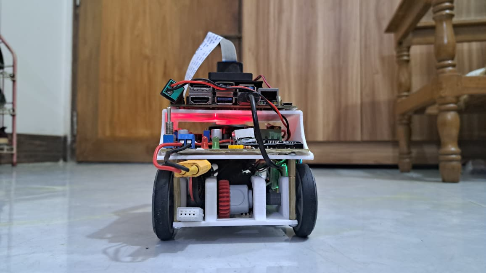
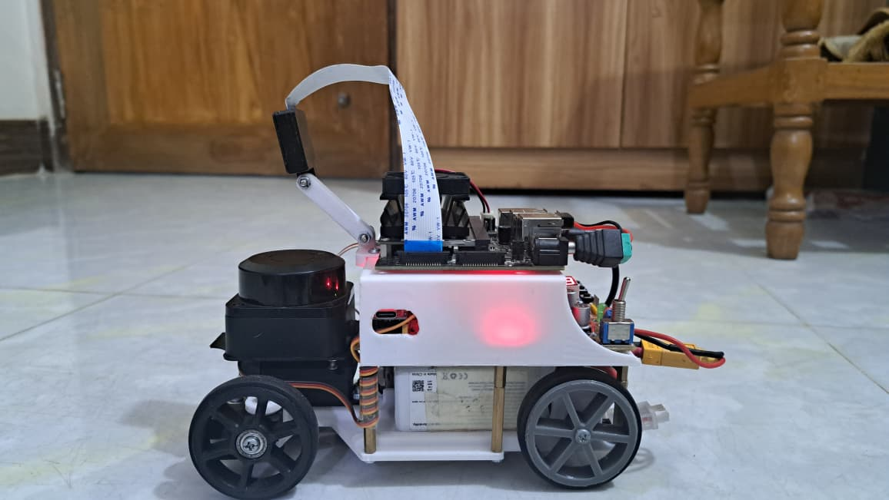
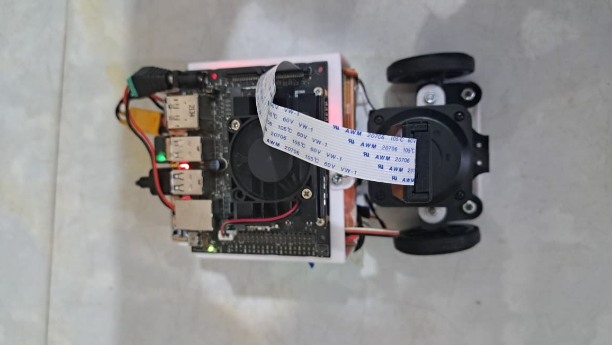
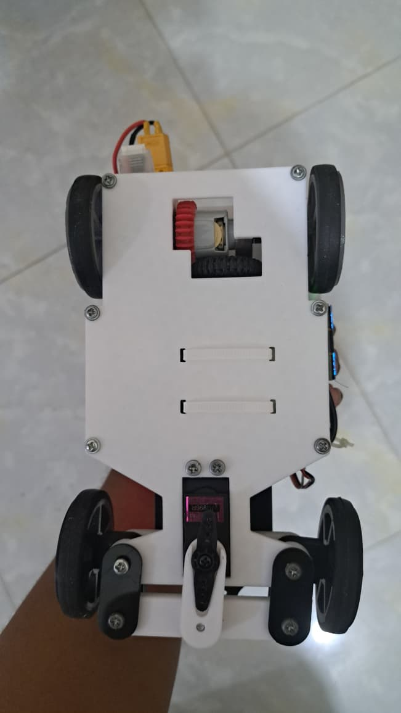
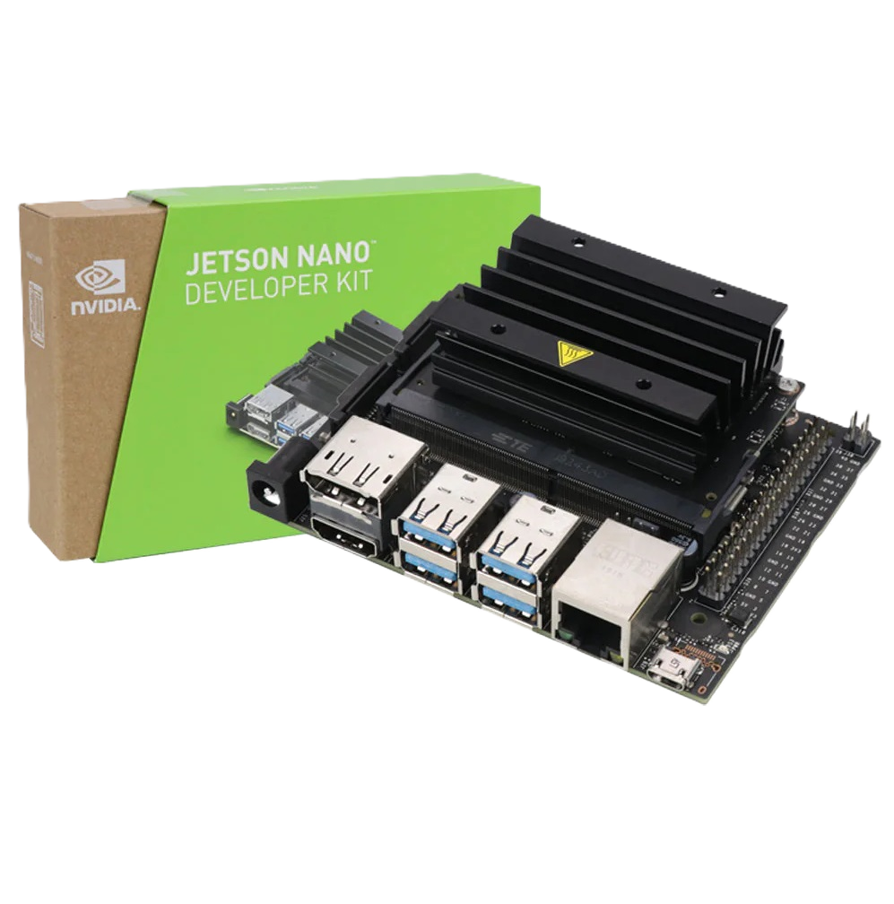

# WRO-2025 Future Engineers 🛠️ Durnibar_71 🛠️ 

  

This repository contains our work for the **WRO Future Engineers** category.  
We are building an **Autonomous Car** using **Lidar, Computer Vision, Arduino nano, and Jetson Nano Dev Kit B01**.

---

## 👥 Team - Durnibar_71
- **Azmain Shak Rubayed** – Team Leader, Hardware Developer || [azmiansheikh.nub@gmail.com](mailto:azmiansheikh.nub@gmail.com)
- **Mohit Hasan** - Software Developer || [mohithasan.nub@gmail.com](mailto:azmiansheikh.nub@gmail.com)
---

## 🌟 The Meaning Behind "Durnibar_71"

> *"If the will to win is strong, then any goal can be achieved."*  

This is our **first participation in WRO**, and ever since we began working on this project, we have felt an **indomitable desire** to complete it. That is why we chose the name **"Durnibar"** *(Indomitable / Unstoppable)* — it reflects our relentless effort to give our absolute best, pushing beyond our current limits despite the challenges we faced.  

Every step of this journey has been difficult. We did not have adequate support, so we had to start from scratch and gather every resource on our own. This struggle itself embodies the true spirit of **Durnibar**, a determination to never give up.  

Now, why the **'71**?  
It represents the spirit of the **Bangladesh Liberation War of 1971**. Our independence was achieved not with abundant resources, but with an **unbreakable willpower and focus**. At that time, we were a nation decades behind the rest of the world, yet we shaped our own destiny.  

By carrying the name **Durnibar_71**, we honor that history and commemorate the indomitable willpower of our nation. Just as the people of ’71 stood unstoppable in their pursuit of freedom, we carry the same spirit forward in our journey — in robotics, innovation, and beyond.  

✨ Thank you, everyone, for standing with us in this mission. Together, we move forward with the spirit of **Durnibar_71** — unstoppable, unbreakable, indomitable.  

---

## 📌 Table of Contents
- [🚙 Overview](#-overview)
- [👥 Team Introduction & Information](#-team-introduction--information)
- [📝 Project Description](#-project-description)
- [🔧 Hardware Used](#-hardware-used)
- [💻 Software & Libraries](#-software--libraries)
- [🏆 Competition Challenges](#-competition-challenges)
- [⚠️ Spoilers](#-spoilers)

---
## 🚙 Overview
Our self-driving vehicle prototype, developed for the **WRO Future Engineers 2025** competition, is a fully autonomous robotic system that merges **AI-based decision-making** with precise embedded hardware control.  

The platform is powered by a **Jetson Nano**, serving as the brain for vision and high-level processing, while an **Arduino Nano** handles real-time actuation and sensor management through custom firmware. Sensor data from the **MPU6050 (IMU)** and **QMC5883L (Compass)** is transmitted via serial communication, enabling accurate orientation tracking, drift correction, and smooth navigation.  

The system integrates:  
- **Raspberry Pi Camera v2.1** for image capture and object detection.  
- **MG996R servo motor** and **BTS7960 motor driver** for steering and propulsion control.  
- **1.3" OLED display**, **LED indicators**, **buzzer**, and **3 control buttons** for debugging and feedback.  

Structurally, the vehicle features a **custom PCB** for streamlined connections, alongside a **self-designed chassis**, built for optimal component placement and balance. Power is delivered through a **1000 mAh LiPo battery**, ensuring lightweight mobility and sufficient runtime for competition tasks.  

All functions are distributed between the **Jetson Nano** (core AI/vision algorithms) and the **Arduino Nano** (low-level hardware control), communicating through **PWM, UART, and I²C protocols**. This modular and efficient design ensures the vehicle can **adapt dynamically to track environments**, while maintaining precise actuation and reliable decision-making.  

Altogether, **Durnibar_71** represents an **indomitable and competition-ready platform**, combining embedded intelligence, compact hardware design, and robust autonomy.

## 📂 Repo Structure

- [`media/`](./media) → Images, GIFs, project assets  
- [`models/`](./models) → 3D models, CAD files  
- [`schematic/`](./schematic) → Circuit diagrams, PCB layouts  
- [`software-setup/`](./software-setup) → Installation guides, environment setup  
- [`src/`](./src) → Source code (control, navigation, AI/ML)  
- [`t-photos/`](./t-photos) → Team photos  
- [`v-photos/`](./v-photos) → Vehicle photos  
- [`videos/`](./videos) → Project demo videos  

📜 [`LICENSE`](./LICENSE) → License information  
📖 [`README.md`](./README.md) → Project documentation

## 📸 Visual Views

Here are the reference views of **Durnibar_71**:

| Front View | Back View | Left View |
|------------|-----------|-----------|
|  |  |  |

| Right View | Top View | Bottom View |
|------------|----------|-------------|
|  |  |  |

---

## 👥 Team Introduction & Information
<table>
  <tr>
    <td align="center" width="300px" style="border: 2px solid #4CAF50; border-radius: 10px; padding: 10px;">
        
      <b>AZMAIN SHAK RUBAYED</b> 
      <i>Team Leader, Hardware Developer</i> 
      📧 <a href="mailto:azmiansheikh.nub@gmail.com">azmiansheikh.nub@gmail.com</a>
    </td>
    <td align="center" width="300px" style="border: 2px solid #4CAF50; border-radius: 10px; padding: 10px;">
        
      <b>MOHIT HASAN</b> 
      <i>Software Developer</i> 
      📧 <a href="mailto:mohithasan.nub@gmail.com">mohithasan.nub@gmail.com</a>
    </td>
  </tr>
</table>

---

## 📝 Project Description

### 💡 Problem Statement
How can a robot dynamically avoid both **visible and invisible obstacles** in real-time using **multi-sensor fusion**?  

The challenge is to design a system that can **sense, process, and act** efficiently in dynamic environments, integrating inputs from IMU, compass, camera, and other sensors to make split-second decisions while navigating autonomously.

### 🎯 Goals
- Implement **real-time obstacle detection and avoidance** using multiple sensors (MPU6050, QMC5883L, Raspberry Pi Camera).  
- Achieve **smooth navigation and path planning** using sensor fusion and AI algorithms on the Jetson Nano.  
- Enable **Arduino Nano** to handle low-level actuation and immediate response while syncing with the Jetson Nano.  
- Build a **modular and scalable robot architecture** that can adapt to changing track conditions.  
- Demonstrate a **robust autonomous system** suitable for WRO Future Engineers competition tasks.

## 🧩 Components & Hardware

| Component | Description | Specifications | Purpose | Image |
|-----------|-------------|-------------|---------|----------|
| **NVIDIA Jetson Nano** | Central processing unit handling high-level computations, including image processing and decision-making | Quad-core ARM Cortex-A57 CPU, 128-core Maxwell GPU, 4GB LPDDR4 RAM, Ubuntu-based OS | Executes ROS nodes, processes camera inputs, manages autonomous navigation algorithms |   NVIDIA Jetson Nano |
| **Raspberry Pi Camera V2.1** | Provides real-time video feed for object detection and lane tracking | 8MP Sony IMX219 sensor, 1080p30/720p60/640x480p90 video modes | Captures visual data for Jetson Nano processing |
| **MPU6050 (Gyroscope + Accelerometer)** | Measures robot orientation and motion | 3-axis gyroscope, 3-axis accelerometer, I²C interface | Provides orientation data for navigation and stability |
| **QMC5883L (Magnetometer)** | Measures magnetic field to determine heading | 3-axis magnetometer, I²C interface | Assists in compass heading determination |
| **Arduino Nano** | Microcontroller for low-level motor control and sensor interfacing | ATmega328P, 14 digital I/O pins, 8 analog inputs, 5V operating voltage | Interfaces with sensors and motor drivers to control movement |
| **MG996R Servo Motor** | Provides steering control | Torque: 9.4 kg·cm, Operating voltage: 4.8–6.8V, Speed: 0.2s/60° | Adjusts the robot's steering mechanism |
| **BTS7960 Motor Driver** | Drives robot wheels via DC motors | Dual H-Bridge, 5.5–40V operating voltage, Continuous current: 43A | Controls speed and direction of the robot |
| **1000mAh LiPo Battery** | Powers the robot | Voltage: 3.7V, Capacity: 1000mAh, Discharge rate: 25C | Provides portable power to the robot |
| **Custom PCB** | Houses circuit components and connections | Custom layout for all components | Ensures reliable electrical connections and compact design |

## Software & Libraries
List your software/libraries here...

## Competition Challenges
Talk about your challenges here...

## Spoilers
Add spoilers or extras here...

---

## 🛠️ Features
- Lane detection with OpenCV
- Obstacle detection using Lidar/Ultrasonic
- PID speed & steering control
- Simulation with ROS + Gazebo
- Autonomous navigation with waypoints

---

## 📜 License
This project is licensed under the **MIT License** – see the [LICENSE](LICENSE) file for details.
