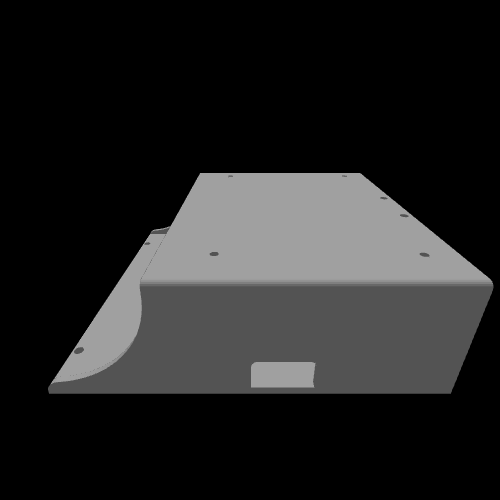
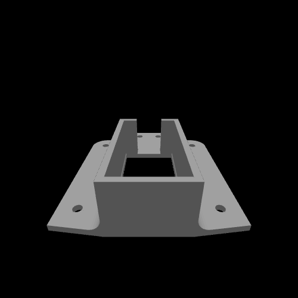
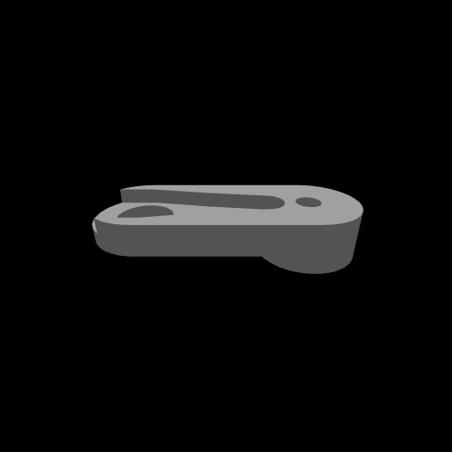
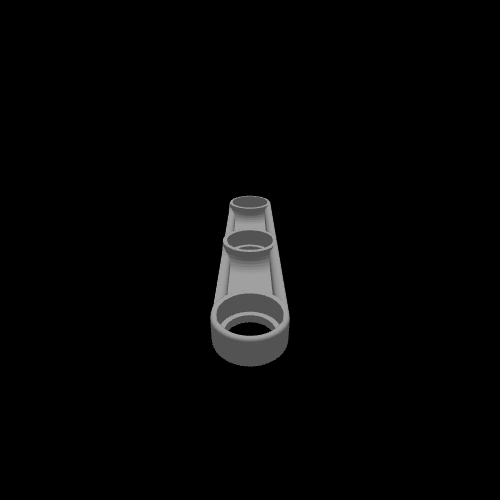
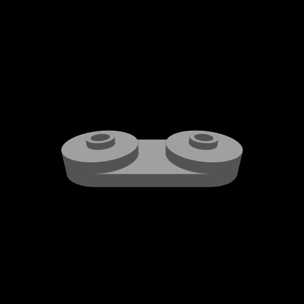

# ⚙️ 3D Models – Durnibar_71

This directory contains the **custom 3D models** designed for the **Durnibar_71 autonomous vehicle**.  
Each part has both a **3D preview (.gif)** and a **downloadable CAD model (.stl)**.  

---

## 📊 Quick Reference Table

| Component | Preview | STL File |
|-----------|---------|----------|
| 🛞 Wheel |  | [Durniabr_71_Wheels.stl](./Durniabr_71_Wheels.stl) |
| 🏎️ Base Frame |  | [Durnibar_71_Base.stl](./Durnibar_71_Base.stl) |
| 🔌 Circuit & Jetson Shield |  | [Durnibar_71_Circuit&Jetson_Shild.stl](./Durnibar_71_Circuit&Jetson_Shild.stl) |
| 🛰️ RPLidar C1 Mount |  | [Durnibar_71_RPLidar-C1_mount.stl](./Durnibar_71_RPLidar-C1_mount.stl) |
| ⚙️ Servo Clamper |  | [Durnibar_71_Servo_Clamper.stl](./Durnibar_71_Servo_Clamper.stl) |
| 🎮 Steering Stick |  | [Durnibar_71_Steering_stick.stl](./Durnibar_71_Steering_stick.stl) |
| 🔩 Wheel Holder |  | [Durnibar_71_Wheel_holder.stl](./Durnibar_71_Wheel_holder.stl) |
| 🛡️ Side Guard |  | [Durnibar_71_side_gg.stl](./Durnibar_71_side_gg.stl) |

---

## 🛞 Wheel

  

- File: [Durniabr_71_Wheels.stl](./Durniabr_71_Wheels.stl)  
- Role: Custom wheel designed for traction and stability on competition tracks.  

---

## 🏎️ Base Frame

  

- File: [Durnibar_71_Base.stl](./Durnibar_71_Base.stl)  
- Role: Lightweight chassis optimized for balance, wiring, and modular mounting.  

---

## 🔌 Circuit & Jetson Shield

  

- File: [Durnibar_71_Circuit&Jetson_Shild.stl](./Durnibar_71_Circuit&Jetson_Shild.stl)  
- Role: Secure mount for **custom PCB + Jetson Nano**, ensuring clean integration.  

---

## 🛰️ RPLidar C1 Mount

  

- File: [Durnibar_71_RPLidar-C1_mount.stl](./Durnibar_71_RPLidar-C1_mount.stl)  
- Role: Provides stable positioning for **RPLidar C1 sensor**.  

---

## ⚙️ Servo Clamper

  

- File: [Durnibar_71_Servo_Clamper.stl](./Durnibar_71_Servo_Clamper.stl)  
- Role: Holds servo motors in place with precision alignment.  

---

## 🎮 Steering Stick

  

- File: [Durnibar_71_Steering_stick.stl](./Durnibar_71_Steering_stick.stl)  
- Role: Mechanism for steering control linked to servo clampers.  

---

## 🔩 Wheel Holder

  

- File: [Durnibar_71_Wheel_holder.stl](./Durnibar_71_Wheel_holder.stl)  
- Role: Provides durability and stability for wheel mounting.  

---

## 🛡️ Side Guard

  

- File: [Durnibar_71_side_gg.stl](./Durnibar_71_side_gg.stl)  
- Role: Side protection for wiring and components, preventing collision damage.  

---

## 📌 Notes
- All parts are **custom-designed** for Durnibar_71.  
- Optimized for **3D printing** with minimal support requirements.  
- Ensures a **strong, modular, and competition-ready** robot structure.  
