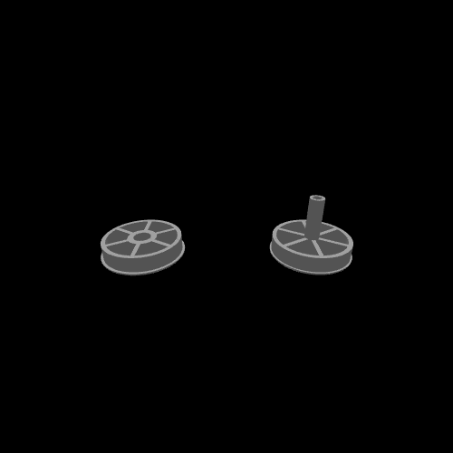
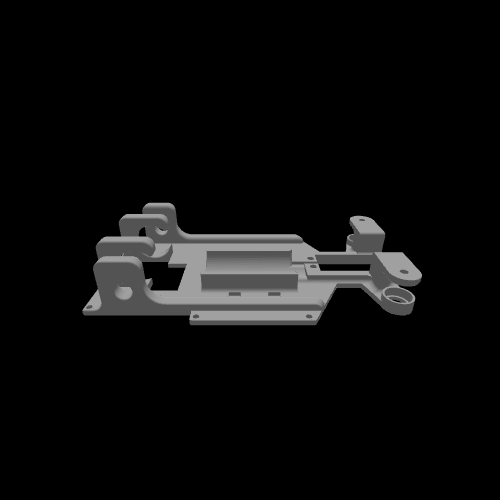
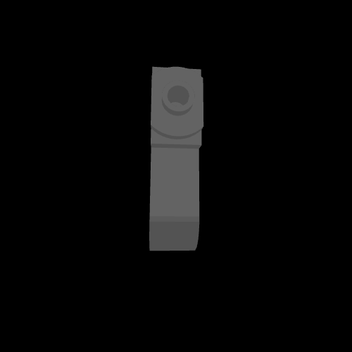

# ⚙️ 3D Models – Durnibar_71

This directory contains the **custom 3D models** designed for the **Durnibar_71 autonomous vehicle**.  
Each part has both a **3D preview (.stl)** and an **animated render (.gif)** for easy visualization.  

---

## 🛞 Wheel Design

  

- File: [Durniabr_71_Wheels.stl](./Durniabr_71_Wheels.stl)  
- Role: Custom wheel optimized for traction and stability.  

---

## 🏎️ Base Frame

  

- File: [Durnibar_71_Base.stl](./Durnibar_71_Base.stl)  
- Role: Lightweight custom chassis designed for **component integration & balanced load distribution**.  

---

## 🔩 Wheel Holder

  

- File: [Durnibar_71_Wheel_holder.stl](./Durnibar_71_Wheel_holder.stl)  
- Role: Mounts the wheels securely to the chassis, ensuring durability under high torque.  

---

## 📌 Notes
- All models were **self-designed** using CAD.  
- Optimized for **lightweight durability** and **easy 3D printing**.  
- Designed specifically for **Durnibar_71** to fit the PCB, sensors, and mechanical structure.  

---

✨ These 3D parts form the **mechanical backbone** of our robot, balancing **strength, weight, and precision**.  
