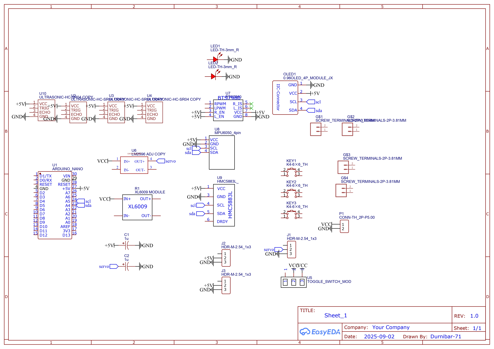
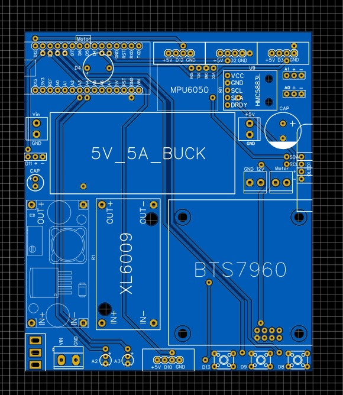
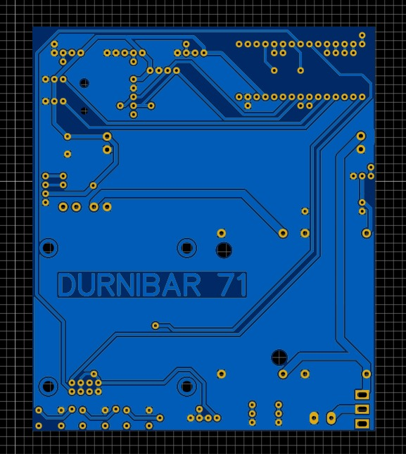
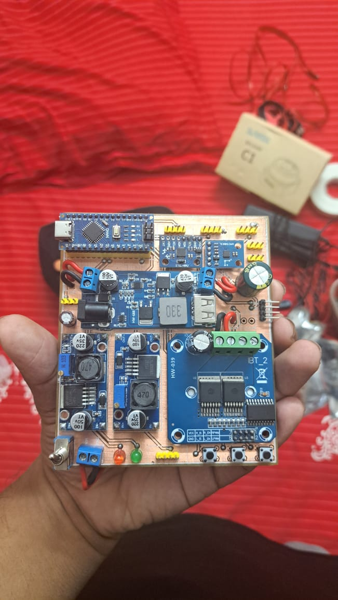
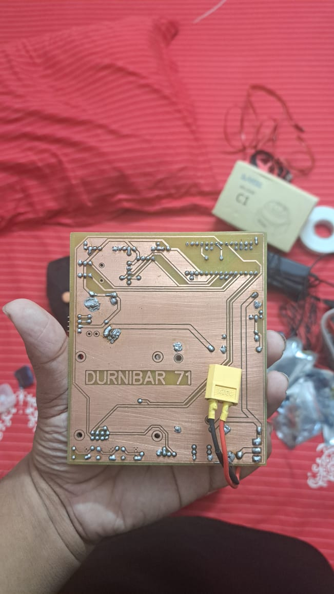

# 🛠️ Schematics & PCB Layout – Durnibar_71

This directory contains the circuit schematics, PCB layouts, and assembly previews for **Durnibar_71 – WRO Future Engineers 2025**.

---

## 📌 Schematic Diagram
The main circuit schematic designed for power management, motor driver, and sensor integration.

  

---

## 📌 PCB Layouts

| Top View | Bottom View |
|----------|-------------|
|  |  |

---

## 📌 Assembly Previews

| Assembled Top | Assembled Bottom |
|---------------|------------------|
|  |  |

---

## 📌 JSON Design File
The KiCad/Eagle/Other EDA export file for PCB:

- [Durnibar_71.json](./Durnibar_71.json)

---

✨ This section documents the **electronics backbone** of Durnibar_71, ensuring proper connectivity between **Jetson Nano, Arduino Nano, MPU6050, QMC5883L, OLED, Motor Driver, Servo, and sensors**.
